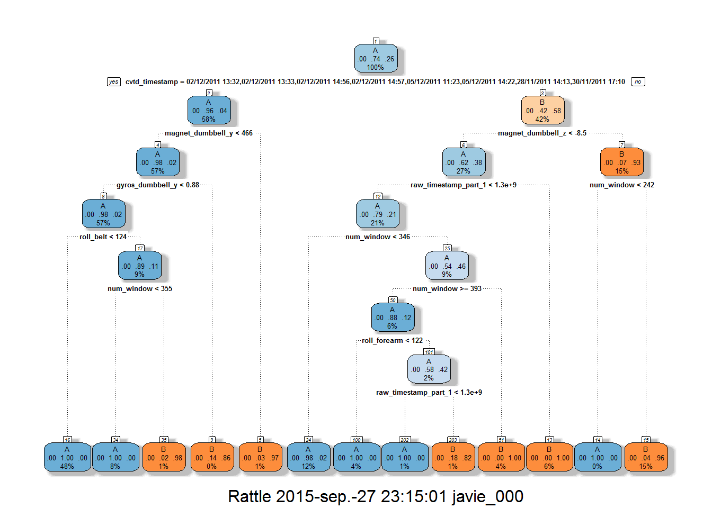

# Coursera: Practical Machine Learning Course Project
ardiaful  
September, 2015  

##Background 
Using devices such as Jawbone Up, Nike FuelBand, and Fitbit it is now possible to collect a large amount of data about personal activity relatively inexpensively. These type of devices are part of the quantified self movement - a group of enthusiasts who take measurements about themselves regularly to improve their health, to find patterns in their behavior, or because they are tech geeks. One thing that people regularly do is quantify how much of a particular activity they do, but they rarely quantify how well they do it. 

## Goal
In this project, our goal is to use data from accelerometers on the belt, forearm, arm, and dumbell of 6 participants to predict the manner in which they did the exercise. This is the "classe" variable in the training set. 

Next we are going to create a report describing how we build our model, how we use cross validation, what we think the expected out of sample error is, and why we make the choices we did. We will also use our prediction model to predict 20 different test cases. 

##Data 
The training data for this project are available here: 

https://d396qusza40orc.cloudfront.net/predmachlearn/pml-training.csv

The test data are available here: 

https://d396qusza40orc.cloudfront.net/predmachlearn/pml-testing.csv

The data for this project come from this source: http://groupware.les.inf.puc-rio.br/har. If you use the document you create for this class for any purpose please cite them as they have been very generous in allowing their data to be used for this kind of assignment. 

##Setting up required libraries
The following libraries are to be used in the Project: 


```r
library(caret)
```

```
## Loading required package: lattice
## Loading required package: ggplot2
```

```r
library(rpart)
library(rpart.plot)
library(RColorBrewer)
library(rattle)
```

```
## Loading required package: RGtk2
## Rattle: A free graphical interface for data mining with R.
## Versión 3.5.0 Copyright (c) 2006-2015 Togaware Pty Ltd.
## Escriba 'rattle()' para agitar, sacudir y  rotar sus datos.
```

```r
library(randomForest)
```

```
## randomForest 4.6-10
## Type rfNews() to see new features/changes/bug fixes.
```

##Load and read data 
First we upload the required data:

```r
trainUrl <-"https://d396qusza40orc.cloudfront.net/predmachlearn/pml-training.csv"
testUrl <- "https://d396qusza40orc.cloudfront.net/predmachlearn/pml-testing.csv"
download.file(trainUrl, destfile="./data/trainFile.csv")
download.file(testUrl, destfile="./data/testFile.csv")
```
After uploading the data we read the two csv files: 

```r
trainRaw <- read.csv("./data/trainFile.csv")
testRaw <- read.csv("./data/testFile.csv")
dim(trainRaw)
```

```
## [1] 19622   160
```

```r
dim(testRaw)
```

```
## [1]  20 160
```
AS we can see the training data set contains 19,622 observations with 160 variables. The testing data set contains 20 observations and 160 variables. The "classe" variable in the training set is the outcome that we must predict.

##Partioning the data 
In this step we divide the training data set into two data sets: 60% for "myTraining"" and 40% for "myTesting":

```r
train.p <- createDataPartition(y=trainRaw$classe, p=0.6, list=FALSE)
myTraining <- trainRaw[train.p, ]
myTesting <- trainRaw[-train.p, ]
dim(myTraining)
```

```
## [1] 11776   160
```

```r
dim(myTesting)
```

```
## [1] 7846  160
```

##Cleaning the data 
The following transformations are used to clean the data:

- Transformation 1: cleans NearZeroVariance Variables:

```r
myDataNZV <- nearZeroVar(myTraining, saveMetrics=TRUE)
```
This creates a subset without NZV variables:

```r
myNZVvars <- names(myTraining) %in% c("new_window", "kurtosis_roll_belt", "kurtosis_picth_belt",
"kurtosis_yaw_belt", "skewness_roll_belt", "skewness_roll_belt.1", "skewness_yaw_belt",
"max_yaw_belt", "min_yaw_belt", "amplitude_yaw_belt", "avg_roll_arm", "stddev_roll_arm",
"var_roll_arm", "avg_pitch_arm", "stddev_pitch_arm", "var_pitch_arm", "avg_yaw_arm",
"stddev_yaw_arm", "var_yaw_arm", "kurtosis_roll_arm", "kurtosis_picth_arm",
"kurtosis_yaw_arm", "skewness_roll_arm", "skewness_pitch_arm", "skewness_yaw_arm",
"max_roll_arm", "min_roll_arm", "min_pitch_arm", "amplitude_roll_arm", "amplitude_pitch_arm",
"kurtosis_roll_dumbbell", "kurtosis_picth_dumbbell", "kurtosis_yaw_dumbbell", "skewness_roll_dumbbell",
"skewness_pitch_dumbbell", "skewness_yaw_dumbbell", "max_yaw_dumbbell", "min_yaw_dumbbell",
"amplitude_yaw_dumbbell", "kurtosis_roll_forearm", "kurtosis_picth_forearm", "kurtosis_yaw_forearm",
"skewness_roll_forearm", "skewness_pitch_forearm", "skewness_yaw_forearm", "max_roll_forearm",
"max_yaw_forearm", "min_roll_forearm", "min_yaw_forearm", "amplitude_roll_forearm",
"amplitude_yaw_forearm", "avg_roll_forearm", "stddev_roll_forearm", "var_roll_forearm",
"avg_pitch_forearm", "stddev_pitch_forearm", "var_pitch_forearm", "avg_yaw_forearm",
"stddev_yaw_forearm", "var_yaw_forearm")
myTraining <- myTraining[!myNZVvars]
#To check the new N?? of observations
dim(myTraining)
```

```
## [1] 11776   100
```

- Transformation 2: deletes first column of the data set, so that it does not interfer with algorithms:

```r
myTraining <- myTraining[c(-1)]
```

- Transformation 3: cleans variables with too many NAs. For Variables that have more than a 60% threshold of NAs we leave them out:

```r
trainingV3 <- myTraining #creating another subset to iterate in loop
for(i in 1:length(myTraining)) { #for every column in the training dataset
        if( sum( is.na( myTraining[, i] ) ) /nrow(myTraining) >= .6 ) { #if n?? NAs > 60% of total observations
        for(j in 1:length(trainingV3)) {
            if( length( grep(names(myTraining[i]), names(trainingV3)[j]) ) ==1)  { #if the columns are the same:
                trainingV3 <- trainingV3[ , -j] #Remove that column
            }   
        } 
    }
}
#To check the new N?? of observations
dim(trainingV3)
```

```
## [1] 11776    58
```

```r
#Seting back to our set:
myTraining <- trainingV3
rm(trainingV3)
```
Now we perform the exact same 3 transformations on "myTesting"" and testing data sets:

```r
clean1 <- colnames(myTraining)
clean2 <- colnames(myTraining[, -58]) #already with classe column removed
myTesting <- myTesting[clean1]
testing <- testRaw[clean2]

#To check the new N?? of observations
dim(myTesting)
```

```
## [1] 7846   58
```

```r
#To check the new N?? of observations
dim(testing)
```

```
## [1] 20 57
```
In order to ensure proper functioning of Decision Trees and especially RandomForest Algorithms with the test data set, we coerce the data into the same type:

```r
for (i in 1:length(testing) ) {
        for(j in 1:length(myTraining)) {
        if( length( grep(names(myTraining[i]), names(testing)[j]) ) ==1)  {
            class(testing[j]) <- class(myTraining[i])
        }      
    }      
}
#And to make sure Coertion really worked, simple smart ass technique:
testing <- rbind(myTraining[2, -58] , testing) #note row 2 does not mean anything, this will be removed right.. now:
testing <- testing[-1,]
```

##Data Modeling
First we use a **Decision Tree Algorithm**:

```r
modFitA1 <- rpart(classe ~ ., data=myTraining, method="class")
fancyRpartPlot(modFitA1)
```

 
For prediction: 

```r
predictionsA1 <- predict(modFitA1, myTesting, type = "class")
confusionMatrix(predictionsA1, myTesting$classe)
```

```
## Confusion Matrix and Statistics
## 
##           Reference
## Prediction    A    B    C    D    E
##          A 2156   65    8    2    0
##          B   62 1265   84   67    0
##          C   14  178 1259  198    2
##          D    0   10   17  948  168
##          E    0    0    0   71 1272
## 
## Overall Statistics
##                                          
##                Accuracy : 0.8794         
##                  95% CI : (0.872, 0.8866)
##     No Information Rate : 0.2845         
##     P-Value [Acc > NIR] : < 2.2e-16      
##                                          
##                   Kappa : 0.8475         
##  Mcnemar's Test P-Value : NA             
## 
## Statistics by Class:
## 
##                      Class: A Class: B Class: C Class: D Class: E
## Sensitivity            0.9659   0.8333   0.9203   0.7372   0.8821
## Specificity            0.9866   0.9663   0.9395   0.9703   0.9889
## Pos Pred Value         0.9664   0.8559   0.7626   0.8294   0.9471
## Neg Pred Value         0.9865   0.9603   0.9824   0.9496   0.9739
## Prevalence             0.2845   0.1935   0.1744   0.1639   0.1838
## Detection Rate         0.2748   0.1612   0.1605   0.1208   0.1621
## Detection Prevalence   0.2843   0.1884   0.2104   0.1457   0.1712
## Balanced Accuracy      0.9763   0.8998   0.9299   0.8537   0.9355
```
Secondly, we use a **Random Forest Algorithm**:

```r
modFitB1 <- randomForest(classe ~. , data=myTraining)
```
For prediction: 

```r
predictionsB1 <- predict(modFitB1, myTesting, type = "class")
confusionMatrix(predictionsB1, myTesting$classe)
```

```
## Confusion Matrix and Statistics
## 
##           Reference
## Prediction    A    B    C    D    E
##          A 2232    0    0    0    0
##          B    0 1518    4    0    0
##          C    0    0 1364    2    0
##          D    0    0    0 1283    4
##          E    0    0    0    1 1438
## 
## Overall Statistics
##                                           
##                Accuracy : 0.9986          
##                  95% CI : (0.9975, 0.9993)
##     No Information Rate : 0.2845          
##     P-Value [Acc > NIR] : < 2.2e-16       
##                                           
##                   Kappa : 0.9982          
##  Mcnemar's Test P-Value : NA              
## 
## Statistics by Class:
## 
##                      Class: A Class: B Class: C Class: D Class: E
## Sensitivity            1.0000   1.0000   0.9971   0.9977   0.9972
## Specificity            1.0000   0.9994   0.9997   0.9994   0.9998
## Pos Pred Value         1.0000   0.9974   0.9985   0.9969   0.9993
## Neg Pred Value         1.0000   1.0000   0.9994   0.9995   0.9994
## Prevalence             0.2845   0.1935   0.1744   0.1639   0.1838
## Detection Rate         0.2845   0.1935   0.1738   0.1635   0.1833
## Detection Prevalence   0.2845   0.1940   0.1741   0.1640   0.1834
## Balanced Accuracy      1.0000   0.9997   0.9984   0.9985   0.9985
```

##Conclusion 
**As we can observe, Random Forest yielded better Results than Decision Tree.**

##Running code for submission to the Assignment
For Random Forests we use the following formula, which yielded a much better prediction in in-sample:

```r
predictionsB2 <- predict(modFitB1, testing, type = "class")
```
The function that generates the files with predictions to submit for the assignment:

```r
pml_write_files = function(x){
  n = length(x)
  for(i in 1:n){
    filename = paste0("problem_id_",i,".txt")
    write.table(x[i],file=filename,quote=FALSE,row.names=FALSE,col.names=FALSE)
  }
}

pml_write_files(predictionsB2)
```
